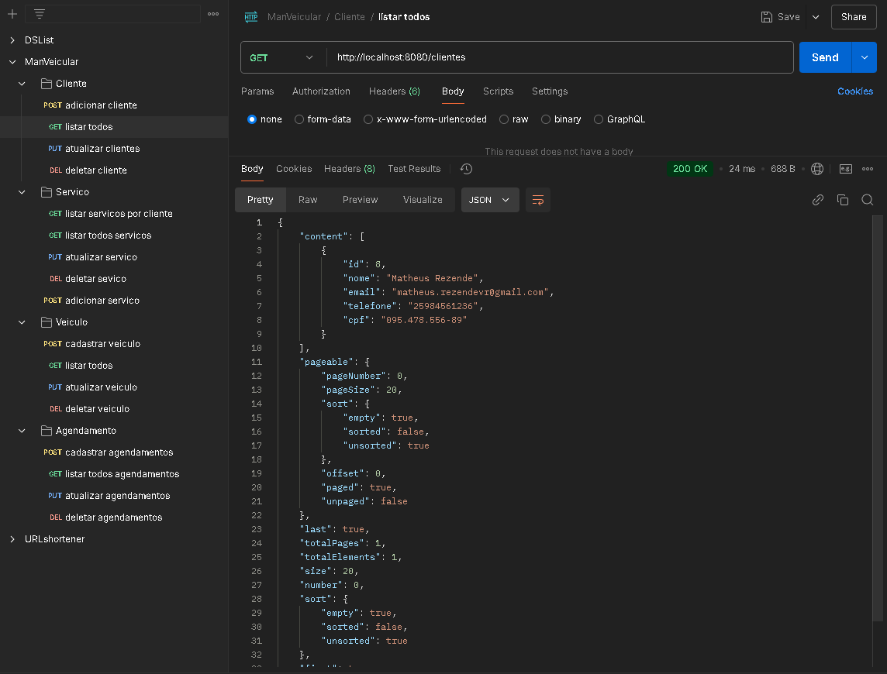

# Sistema de Gerenciamento de Manutenção Veicular - API

### 📋 Sobre o Projeto

O **Sistema de Gerenciamento de Manutenção Veicular** é uma API desenvolvida para gerenciar clientes, veículos, serviços e agendamentos em uma oficina mecânica. Utilizando **Java** e o **Spring Boot**, o sistema oferece uma solução escalável e eficiente para o fluxo de trabalho de manutenção veicular. A API foi projetada seguindo as melhores práticas para APIs RESTful e integra um banco de dados relacional com **MySQL**.

---

### 🛠️ Conceitos e Tecnologias Utilizados

#### 🌐 **Sistemas Web e Recursos**
- **Arquitetura Cliente/Servidor**: Comunicação via HTTP utilizando o formato JSON para a troca de dados.
- **APIs RESTful**: Organização de endpoints de forma semântica e seguindo boas práticas.

#### 📚 **Estruturação do Projeto**
- **Spring Boot**: Framework para o desenvolvimento ágil e escalável de APIs RESTful.
- **Hibernate/JPA**: Mapeamento objeto-relacional (ORM) para gerenciamento dos dados no banco de dados.
- **Lombok**: Simplificação do código com anotações para reduzir boilerplate.
- **MySQL**: Banco de dados relacional para persistência de dados.
- **Java 17**: Linguagem principal utilizada para o desenvolvimento.
- **Maven**: Gerenciador de dependências e build da aplicação.

#### 🔗 **Funcionalidades**
- **Cadastro de Clientes**: Endpoints para criar, listar, atualizar e excluir informações dos clientes.
- **Gerenciamento de Veículos**: Operações CRUD para registrar e gerenciar os veículos dos clientes.
- **Cadastro de Serviços**: Endpoints para gerenciar serviços oferecidos pela oficina.
- **Agendamento de Serviços**: Agende serviços para veículos com datas e horários específicos.
- **Relatórios**: Geração de dados consolidados sobre clientes, veículos e agendamentos.

---

### 📂 Estrutura de Endpoints

---

### 📑 Pré-requisitos para Execução

- **Java 17**
- **Maven 3.8+**
- **MySQL 8.0+**

---

### 🤝 Contribuições

Contribuições são bem-vindas! Siga as etapas abaixo:

1. Faça um *fork* deste repositório.
2. Crie uma *branch* para sua funcionalidade (`git checkout -b feature/nova-funcionalidade`).
3. Envie um *pull request* para análise.

---

### 📖 Referências

- [Documentação Spring Boot](https://spring.io/projects/spring-boot)
- [Documentação Hibernate](https://hibernate.org/documentation/)
- [Documentação MySQL](https://dev.mysql.com/doc/)
